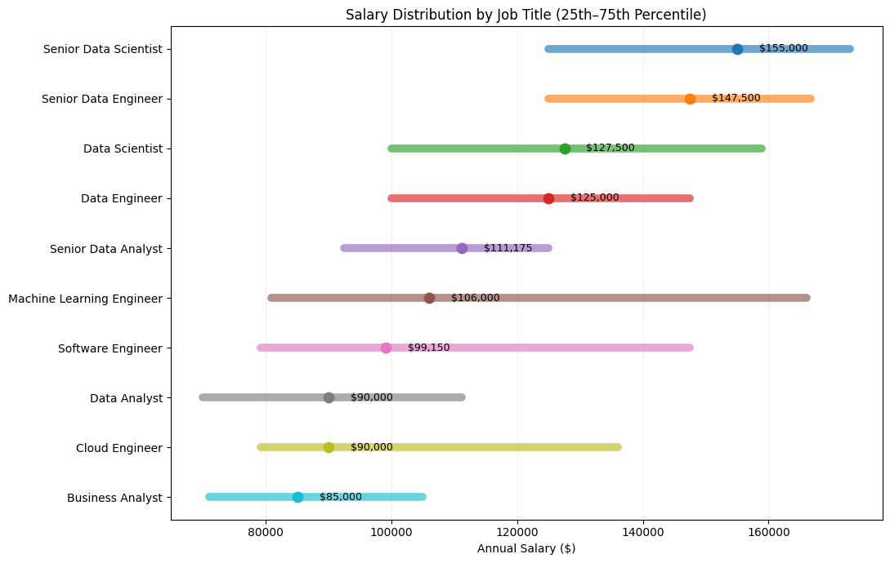

# Advanced Data Market Insights 📊

Welcome to the **Advanced Data Market Insights** repository! This project focuses on analyzing advanced business metrics, job market trends, skill combinations, and salary distributions using PostgreSQL.

---

## Background 💡
Driven by the need to understand deep market dynamics in data roles, this project explores key business questions around job growth, high-paying remote opportunities, and optimal skill combinations.

### Questions Answered by SQL Queries:
1. What are the month-over-month job growth and salary trends?
2. How does skill diversity impact average salaries?
3. Which companies offer top-paying remote opportunities?
4. What are the most frequently paired skills in job postings?
5. What is the salary distribution and percentile spread across job titles?

---

## Tools Used 🛠️
* **PostgreSQL:** Database engine used for advanced data querying and analysis.
* **Visual Studio Code:** Primary IDE for writing and executing SQL scripts.
* **Git & GitHub:** Version control and portfolio hosting.

---

## The Analysis 🔍

1. Month-over-Month Job Growth & Salary Trend
Tracks monthly posting volume and average salary changes over time to identify market momentum.

```sql
WITH monthly_metrics AS (
    SELECT 
        EXTRACT(MONTH FROM job_posted_date) AS month_num,
        TO_CHAR(job_posted_date, 'Month') AS month_name,
        COUNT(job_id) AS total_jobs,
        ROUND(AVG(salary_year_avg), 2) AS avg_salary
    FROM job_postings_fact
    WHERE EXTRACT(YEAR FROM job_posted_date) = 2023
    GROUP BY EXTRACT(MONTH FROM job_posted_date), TO_CHAR(job_posted_date, 'Month') 
)
SELECT 
    month_name,
    total_jobs,
    total_jobs - LAG(total_jobs) OVER (ORDER BY month_num) AS job_growth,
    avg_salary,
    ROUND(avg_salary - LAG(avg_salary) OVER (ORDER BY month_num), 2) AS salary_growth
FROM monthly_metrics
ORDER BY month_num;


2. Skill Diversity vs. Average Salary Benchmark
Analyzes whether knowing more skills correlates with higher average pay.

WITH job_skills_count AS (
    SELECT 
        jpf.job_id,
        jpf.salary_year_avg,
        COUNT(sjd.skill_id) AS skill_count
    FROM job_postings_fact jpf
    INNER JOIN skills_job_dim sjd ON jpf.job_id = sjd.job_id
    WHERE jpf.salary_year_avg IS NOT NULL
    GROUP BY jpf.job_id, jpf.salary_year_avg
)
SELECT 
    skill_count,
    COUNT(job_id) AS total_postings,
    ROUND(AVG(salary_year_avg), 2) AS avg_salary,
    ROUND(MIN(salary_year_avg), 2) AS min_salary,
    ROUND(MAX(salary_year_avg), 2) AS max_salary
FROM job_skills_count
GROUP BY skill_count
HAVING COUNT(job_id) >= 10
ORDER BY skill_count ASC;


3. Top Companies Offering High-Paying Remote Opportunities
Identifies top companies paying above the market average for remote positions.


WITH market_avg AS (
    SELECT AVG(salary_year_avg) AS global_avg_salary
    FROM job_postings_fact
    WHERE salary_year_avg IS NOT NULL
)
SELECT 
    cd.name AS company_name,
    COUNT(jpf.job_id) AS remote_jobs_count,
    ROUND(AVG(jpf.salary_year_avg), 2) AS company_avg_salary,
    ROUND(m.global_avg_salary, 2) AS market_avg_salary
FROM job_postings_fact jpf
INNER JOIN company_dim cd ON jpf.company_id = cd.company_id
CROSS JOIN market_avg m
WHERE jpf.job_work_from_home = TRUE 
  AND jpf.salary_year_avg IS NOT NULL
GROUP BY cd.company_id, cd.name, m.global_avg_salary
HAVING AVG(jpf.salary_year_avg) > m.global_avg_salary AND COUNT(jpf.job_id) >= 3
ORDER BY company_avg_salary DESC
LIMIT 10;


4. Skill Pairing Analysis
Finds the most frequent combinations of skills demanded together in job postings.


WITH job_skills AS (
    SELECT 
        sjd.job_id,
        sd.skills AS skill_name
    FROM skills_job_dim sjd
    INNER JOIN skills_dim sd ON sjd.skill_id = sd.skill_id
)
SELECT 
    js1.skill_name AS primary_skill,
    js2.skill_name AS paired_skill,
    COUNT(*) AS combination_frequency
FROM job_skills js1
INNER JOIN job_skills js2 ON js1.job_id = js2.job_id AND js1.skill_name < js2.skill_name
GROUP BY js1.skill_name, js2.skill_name
ORDER BY combination_frequency DESC
LIMIT 15;


5. Job Salary Distribution Percentiles
Measures salary percentiles (25th, 50th, 75th) across job roles.

SELECT 
    job_title_short,
    COUNT(job_id) AS total_postings,
    ROUND(PERCENTILE_CONT(0.25) WITHIN GROUP (ORDER BY salary_year_avg)::numeric, 2) AS pct_25,
    ROUND(PERCENTILE_CONT(0.50) WITHIN GROUP (ORDER BY salary_year_avg)::numeric, 2) AS median_salary_50,
    ROUND(PERCENTILE_CONT(0.75) WITHIN GROUP (ORDER BY salary_year_avg)::numeric, 2) AS pct_75
FROM job_postings_fact
WHERE salary_year_avg IS NOT NULL
GROUP BY job_title_short
HAVING COUNT(job_id) > 50
ORDER BY median_salary_50 DESC;





What I Learned 🧠

       Advanced Window Functions: Mastered LAG() and PERCENTILE_CONT() for temporal trends and distribution analysis.

       Complex Self-Joins: Learned to run self-joins on junction tables to analyze skill co-occurrence.

       Data Aggregation: Leveraged CTEs combined with HAVING filters to isolate high-value business insights.

Conclusions 📌

       Skill Synergy: Skills like Python & SQL or AWS & Azure frequently appear together in high-paying roles.

       Remote Value: Companies offering remote roles often provide salaries exceeding global market averages. 
